# User Flows - Phrasongsa Timetable System

**Version:** 1.0  
**Last Updated:** December 16, 2025  
**System:** School Timetable Management for Thai Secondary Schools (ม.1-ม.6)

---

## 1. Personas & Actors

### 1.1 Primary Actors

| Actor | Role Code | Description | Authentication |
|-------|-----------|-------------|----------------|
| **System Administrator** | `admin` | Full access to all features. Creates semesters, manages data, builds schedules. | Google OAuth / Email |
| **Teacher** | `teacher` | Views personal teaching schedule. No edit access. | Optional (public view available) |
| **Student** | `student` | Views class schedule. No edit access. | None required |
| **Public Guest** | `guest` | Browses published schedules via homepage search. | None |

### 1.2 System Actors

| Actor | Description |
|-------|-------------|
| **Conflict Detector** | Background validation service checking teacher/class/room conflicts |
| **Export Service** | Generates Excel/PDF timetables on demand |
| **Cron Jobs** | Scheduled tasks (cache invalidation, analytics aggregation) |

---

## 2. Goals (Jobs-to-be-Done)

### Admin Goals
1. **Set up a new academic semester** with periods, breaks, and school days
2. **Manage master data** (teachers, subjects, rooms, classes, programs)
3. **Assign teaching responsibilities** to teachers per subject and class
4. **Build conflict-free timetables** using drag-and-drop interface
5. **Lock timeslots** for assemblies, clubs, and special activities
6. **Detect and resolve conflicts** before publishing
7. **Export timetables** for distribution to teachers and students
8. **Publish semester schedules** for public viewing

### Teacher Goals
1. **View personal weekly schedule** with room assignments
2. **See teaching workload** (hours per week, subjects taught)
3. **Access class rosters** for assigned sections

### Student Goals
1. **View class timetable** by grade level (ม.1/1, ม.2/3, etc.)
2. **Find teacher information** for each subject

### Public Goals
1. **Search for teacher schedules** by name or department
2. **Search for class schedules** by grade level

---

## 3. User Flows

### Flow 1: Admin Login & Semester Selection

**Trigger:** Admin navigates to protected route  
**Preconditions:** User has Google account linked to admin role  
**Success Outcome:** Admin lands on dashboard with selected semester context

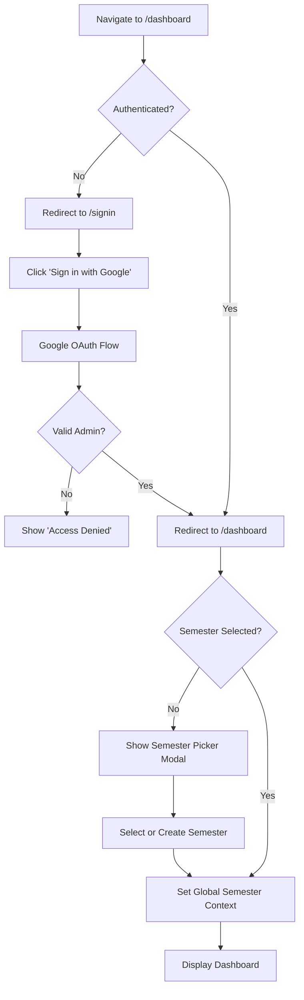

**Steps:**
1. User navigates to any `/dashboard/*` route
2. Middleware checks authentication status
3. If unauthenticated, redirect to `/signin`
4. User clicks "Sign in with Google"
5. OAuth flow completes, session created
6. If no semester selected, show semester picker
7. User selects existing semester or creates new one
8. Global store updated with `semesterAndYear`
9. Dashboard loads with semester context

**Failure Paths:**
- **F1.1:** Google account not authorized → Show "Access Denied" with contact admin message
- **F1.2:** Network error during OAuth → Show retry option
- **F1.3:** No semesters exist → Prompt to create first semester

---

### Flow 2: Create New Semester Configuration

**Trigger:** Admin clicks "Create New Semester" from dashboard  
**Preconditions:** Admin authenticated  
**Success Outcome:** New semester with timeslots generated

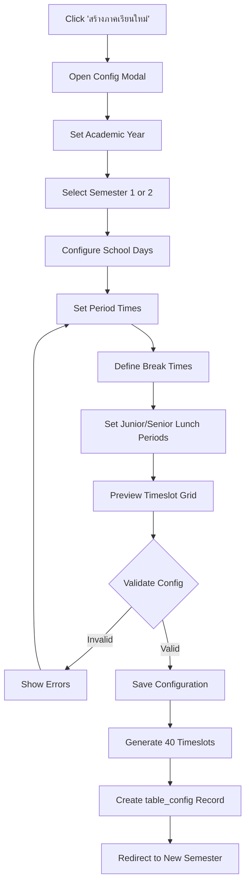

**Steps:**
1. Admin clicks "สร้างภาคเรียนใหม่" (Create New Semester)
2. Modal opens with configuration form
3. Set academic year (e.g., 2568)
4. Select semester (1 or 2)
5. Check school days (default: Mon-Fri)
6. Configure start time, period duration, break duration
7. Set number of periods per day (default: 8)
8. Define junior lunch period (e.g., period 4)
9. Define senior lunch period (e.g., period 5)
10. Preview generated timeslot grid
11. Click "ตั้งค่าตารางเรียน" to save
12. System generates timeslots (e.g., 8 periods × 5 days = 40)
13. Redirect to new semester dashboard

**Failure Paths:**
- **F2.1:** Duplicate semester exists → Show "ภาคเรียนนี้มีอยู่แล้ว"
- **F2.2:** Invalid time configuration → Highlight fields with errors

---

### Flow 3: Teacher CRUD Operations

**Trigger:** Admin navigates to `/management/teacher`  
**Preconditions:** Admin authenticated, semester selected  
**Success Outcome:** Teacher record created/updated/deleted

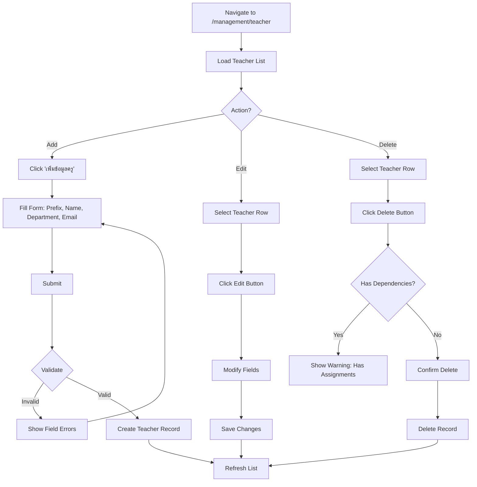

**Steps (Create):**
1. Navigate to `/management/teacher`
2. Click "เพิ่มข้อมูลครู"
3. Fill form: Prefix (นาย/นาง/นางสาว), Firstname, Lastname, Department, Email
4. Click Submit
5. Validation: Email unique, required fields present
6. Record created with auto-generated TeacherID
7. List refreshes with new teacher

**Failure Paths:**
- **F3.1:** Duplicate email → "อีเมลนี้ถูกใช้งานแล้ว"
- **F3.2:** Delete with dependencies → Cannot delete, show linked assignments

---

### Flow 4: Assign Teaching Responsibilities

**Trigger:** Admin navigates to `/schedule/[term]/assign`  
**Preconditions:** Teachers, subjects, and grades exist  
**Success Outcome:** Teacher assigned to teach subject for specific grade

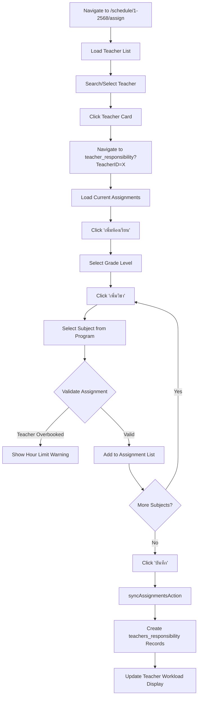

**Steps:**
1. Navigate to `/schedule/1-2568/assign`
2. Search or scroll to find teacher
3. Click teacher card to open assignment page
4. View current assignments (subjects × grades)
5. Click "เพิ่มห้องเรียน" to add new grade
6. Select grade from dropdown (e.g., ม.1/1)
7. Click "เพิ่มวิชา" to add subject
8. Select subject from grade's program curriculum
9. System auto-calculates TeachHour from credit value
10. Repeat for additional subjects/grades
11. Click "บันทึก" to save all assignments
12. Server action syncs changes (create/delete diff)

**Failure Paths:**
- **F4.1:** No teachers exist → Show empty state with link to teacher management
- **F4.2:** Teacher exceeds max hours → Warning but allows save
- **F4.3:** Subject not in grade's program → Subject not shown in dropdown

---

### Flow 5: Drag-and-Drop Schedule Arrangement

**Trigger:** Admin navigates to `/schedule/[term]/arrange/teacher-arrange`  
**Preconditions:** Teacher has assigned responsibilities  
**Success Outcome:** Class schedule created on timeslot

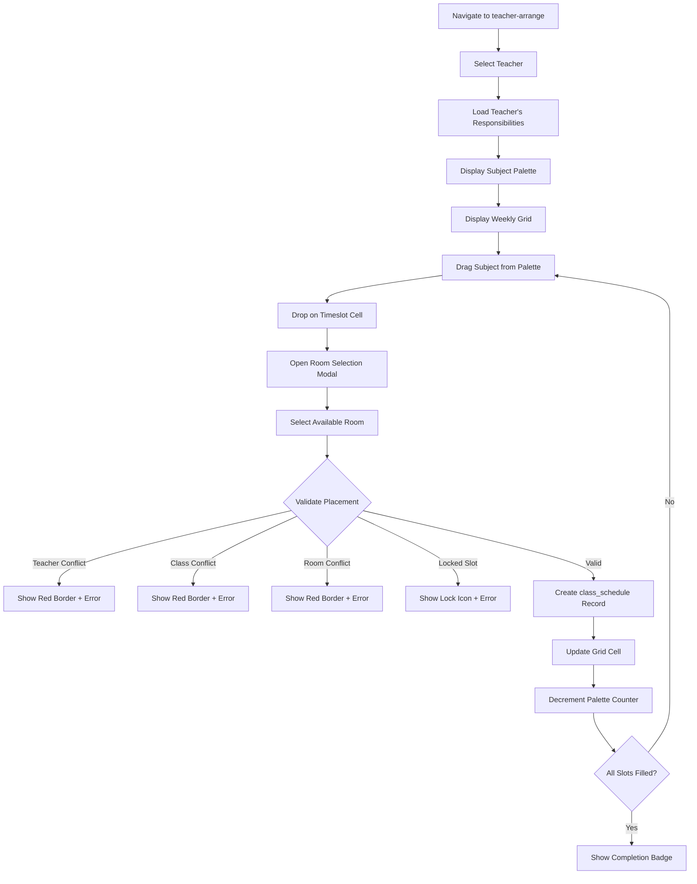

**Steps:**
1. Navigate to `/schedule/1-2568/arrange/teacher-arrange`
2. Select teacher from dropdown
3. View subject palette (left side) with remaining slots
4. View weekly timetable grid (center)
5. Drag subject card from palette
6. Drop on target timeslot cell
7. Room selection modal appears
8. Select available room from list
9. System validates for conflicts:
   - Teacher not double-booked
   - Class not double-booked
   - Room not double-booked
   - Timeslot not locked
10. If valid, schedule created
11. Grid updates, palette counter decrements
12. Repeat until all subjects placed

**Failure Paths:**
- **F5.1:** All slots locked → No valid drop targets
- **F5.2:** No rooms available → Show "ไม่มีห้องว่าง"
- **F5.3:** Network error on save → Show retry toast

---

### Flow 6: Bulk Timeslot Locking

**Trigger:** Admin navigates to `/schedule/[term]/lock`  
**Preconditions:** Semester has generated timeslots  
**Success Outcome:** Selected timeslots marked as locked

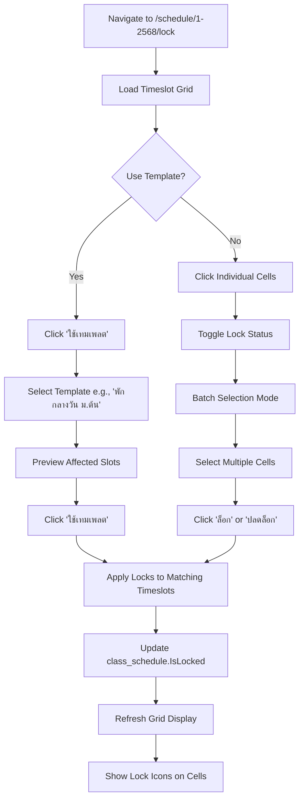

**Steps:**
1. Navigate to `/schedule/1-2568/lock`
2. View timeslot grid with lock status
3. Option A: Use Template
   - Click "ใช้เทมเพลต"
   - Select from predefined templates (lunch breaks, assemblies, etc.)
   - Preview matched timeslots
   - Confirm to apply locks
4. Option B: Manual Selection
   - Click individual cells to toggle lock
   - Use checkbox for batch selection
   - Click "ล็อก" or "ปลดล็อก" for selected cells
5. Locks saved to database
6. Grid updates with lock icons

**Templates Available:**
- พักกลางวัน (ม.ต้น) - Junior lunch at 10:40
- พักกลางวัน (ม.ปลาย) - Senior lunch at 10:55
- กิจกรรมเข้าแถว - Morning assembly
- กิจกรรมชุมนุม - Club activities
- ประชุมระดับชั้น - Grade meetings
- สอบกลางภาค/ปลายภาค - Exam periods

**Failure Paths:**
- **F6.1:** No timeslots exist → Show "กรุณาสร้างตารางเวลาก่อน"
- **F6.2:** Template matches no slots → Show "ไม่พบคาบเรียนที่ตรงกับเกณฑ์"

---

### Flow 7: Conflict Detection & Resolution

**Trigger:** Admin navigates to `/dashboard/[term]/conflicts`  
**Preconditions:** Schedules exist for semester  
**Success Outcome:** All conflicts identified and resolved

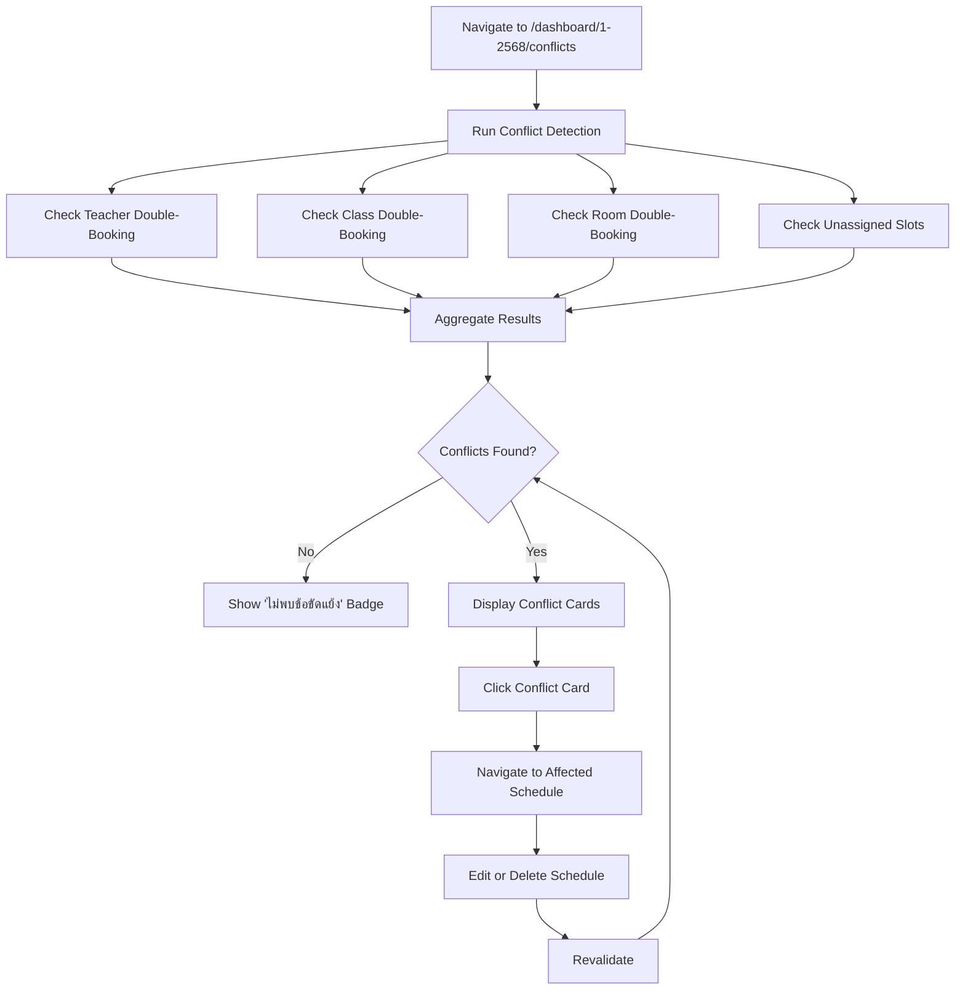

**Conflict Types:**
1. **Teacher Conflict** - Same teacher, same timeslot, different classes
2. **Class Conflict** - Same class, same timeslot, different subjects
3. **Room Conflict** - Same room, same timeslot, different classes
4. **Unassigned** - Timeslot has schedule but no teacher/room

**Steps:**
1. Navigate to conflicts page
2. System runs detection queries
3. Results grouped by conflict type
4. Each conflict shows:
   - Affected resource (teacher/class/room)
   - Timeslot details (day, time)
   - Conflicting schedules
5. Click conflict to navigate to editor
6. Resolve by editing or deleting one schedule
7. Return to conflicts page to verify resolution

---

### Flow 8: Export Timetable to Excel

**Trigger:** Admin clicks export button  
**Preconditions:** Schedules exist for selected entity  
**Success Outcome:** Excel file downloaded

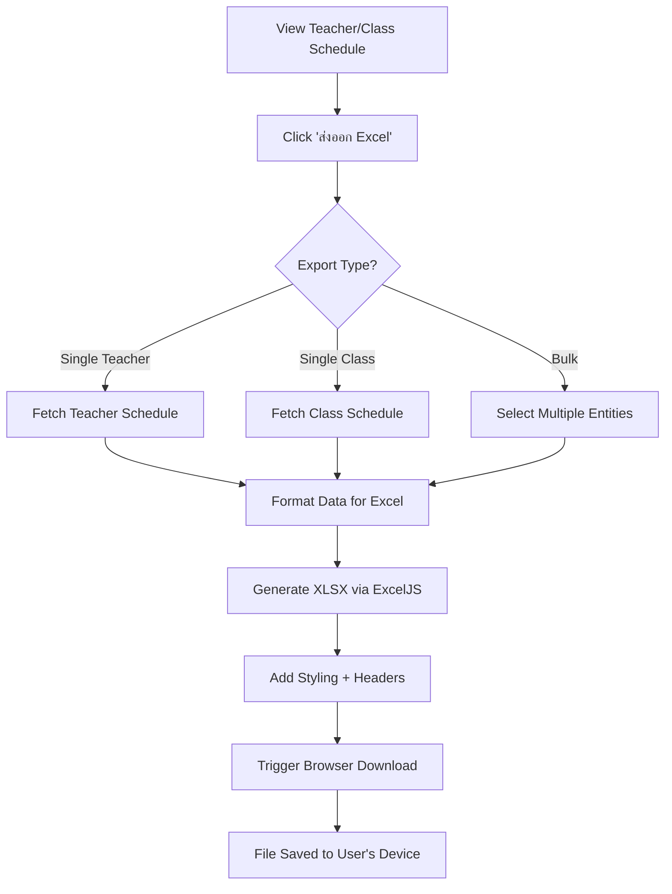

**Steps:**
1. Navigate to teacher or class schedule view
2. Click "ส่งออก Excel" button
3. Select export scope (single or bulk)
4. API generates Excel file:
   - Headers with semester info
   - Weekly grid with subjects, rooms, teachers
   - Color coding by subject type
5. Browser downloads file
6. User opens in Excel/Google Sheets

---

### Flow 9: Publish Semester Schedule

**Trigger:** Admin clicks publish button  
**Preconditions:** Schedule completeness ≥ 30%  
**Success Outcome:** Semester status changed to PUBLISHED

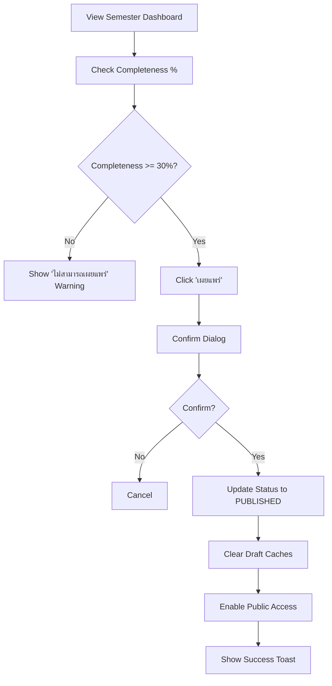

**Steps:**
1. View semester on dashboard
2. Check completeness percentage badge
3. If < 30%, publish button disabled
4. Click "เผยแพร่" (Publish)
5. Confirm dialog appears
6. Confirm to proceed
7. Status updated to PUBLISHED
8. Public routes now return data for this semester
9. Success notification shown

**Status Progression:**
- DRAFT → PUBLISHED → LOCKED → ARCHIVED

---

### Flow 10: Public Schedule Viewing

**Trigger:** Public user navigates to homepage  
**Preconditions:** At least one published semester exists  
**Success Outcome:** User views desired schedule

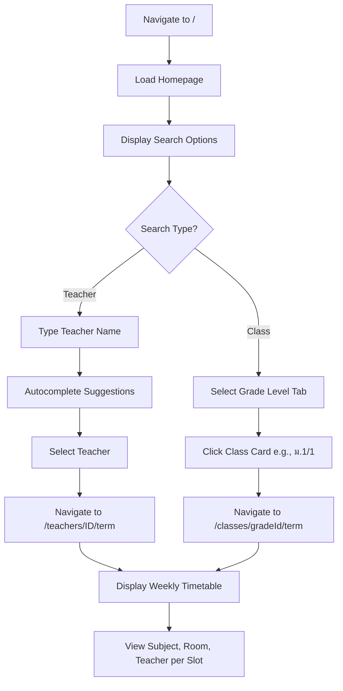

**Steps:**
1. User visits homepage (/)
2. View teacher list with search
3. Option A: Search by teacher name
   - Type in search box
   - Select from autocomplete
   - View teacher's weekly schedule
4. Option B: Browse by class
   - Click "ชั้นเรียน" tab
   - Select grade level
   - View class's weekly schedule
5. Timetable displays:
   - Subject name and code
   - Room assignment
   - Teacher name

---

### Flow 11: Program/Curriculum Management

**Trigger:** Admin navigates to `/management/program`  
**Preconditions:** Admin authenticated  
**Success Outcome:** Program with subjects configured

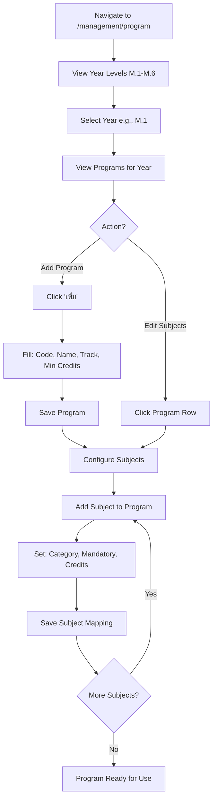

**Steps:**
1. Navigate to `/management/program`
2. Select year level (ม.1 through ม.6)
3. View existing programs (Science-Math, Arts-Lang, etc.)
4. Add new program:
   - Program code (e.g., M1-SCI)
   - Program name (e.g., หลักสูตรวิทย์-คณิต ม.1)
   - Track (SCIENCE_MATH, LANGUAGE_MATH, etc.)
   - Minimum total credits
5. Configure program subjects:
   - Select subject from master list
   - Set category (CORE, ADDITIONAL, ACTIVITY)
   - Mark as mandatory or elective
   - Set min/max credits
6. MOE validation runs automatically

---

### Flow 12: Analytics Dashboard Viewing

**Trigger:** Admin navigates to `/dashboard/[term]/analytics`  
**Preconditions:** Semester has schedule data  
**Success Outcome:** Admin views data visualizations

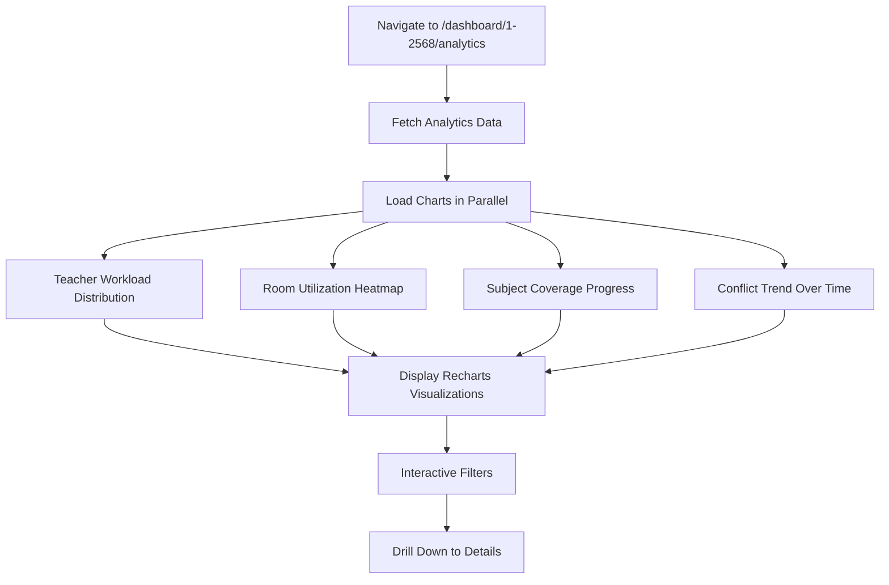

**Visualizations:**
- Teacher workload bar chart (hours/week per teacher)
- Room utilization heatmap (slots used per room per day)
- Subject coverage donut chart (% complete by category)
- Conflict trend line chart (conflicts resolved over time)

---

## 4. Edge Cases & Alternate Paths Summary

| Flow | Edge Case | Handling |
|------|-----------|----------|
| Login | Google account not authorized | Show access denied, suggest contact admin |
| Semester Create | Duplicate semester | Prevent creation, show warning |
| Teacher CRUD | Delete with dependencies | Block delete, show linked assignments |
| Assignment | No teachers exist | Show empty state with management link |
| Drag-Drop | All rooms occupied | Show "ไม่มีห้องว่าง" in modal |
| Locking | Template matches nothing | Show "ไม่พบคาบเรียน" message |
| Conflicts | No conflicts found | Show success badge |
| Export | No schedules exist | Disable export button |
| Publish | Completeness < 30% | Disable publish button |
| Public View | No published semesters | Show "ไม่มีข้อมูล" message |

---

## 5. Flow Dependencies

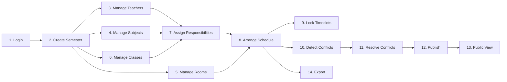

**Legend:**
- Solid arrows indicate required prerequisites
- Flows 3-6 can be done in any order
- Flow 9 (Locking) can be done before or after scheduling
